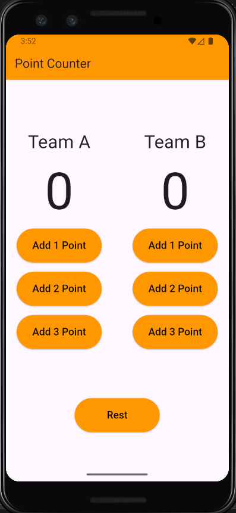

# Basketball Points Counter App

A simple Flutter app to keep track of basketball scores for two teams. Add 1, 2, or 3 points to each team and reset scores easily.

## Features

- Add 1, 2, or 3 points to Team A or Team B
- Reset both teams' scores
- Clean and responsive UI

## Screenshot



## Getting Started

### Prerequisites

- [Flutter SDK](https://flutter.dev/docs/get-started/install)
- IDE (VS Code, Android Studio, etc.)

### Installation

1. Clone the repository:
    ```
    git clone https://github.com/mohamedtmohamed/Basketball-Points-Counter-App.git
    ```
2. Navigate to the project directory:
    ```
    cd basketball_points_counter_app
    ```
3. Run the app:
    ```
    flutter run
    ```

## Usage

- Tap the buttons to add points to Team A or Team B.
- Tap the "Rest" button to reset both scores to zero.